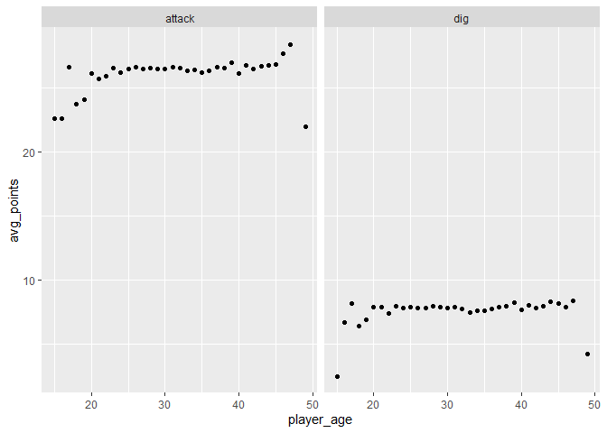
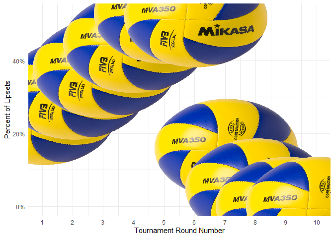
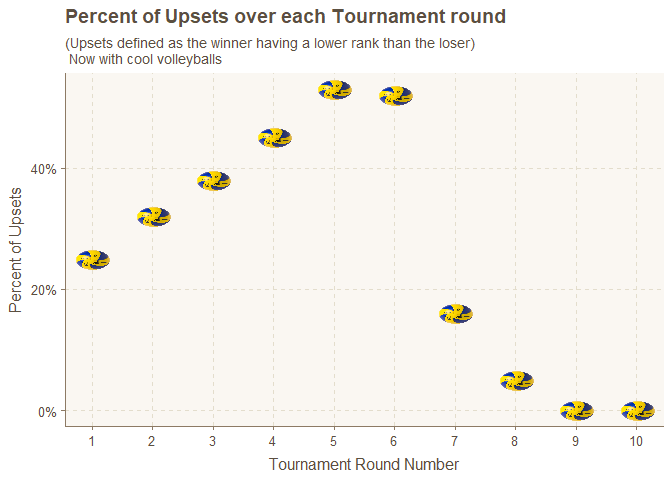

Volleyball ETL
================

# Setup

``` r
# Or read in with tidytuesdayR package (https://github.com/thebioengineer/tidytuesdayR)

# Either ISO-8601 date or year/week works!

# Install via devtools::install_github("thebioengineer/tidytuesdayR")

tuesdata <- tidytuesdayR::tt_load('2020-05-19')
```

    ## --- Downloading #TidyTuesday Information for 2020-05-19 ----

    ## --- Identified 1 files available for download ----

    ## --- Downloading files ---

    ## --- Download complete ---

``` r
# tuesdata <- tidytuesdayR::tt_load(2020, week = 21)


vb_matches <- tuesdata$vb_matches
#i need some of dat memory back thank u
#I also like less stuff in my environment 
rm(tuesdata)
```

``` r
library(tidyverse)
```

    ## -- Attaching packages -------------------------------------------------------------------------- tidyverse 1.3.0 --

    ## v ggplot2 3.3.0     v purrr   0.3.4
    ## v tibble  3.0.1     v dplyr   0.8.5
    ## v tidyr   1.0.2     v stringr 1.4.0
    ## v readr   1.3.1     v forcats 0.5.0

    ## -- Conflicts ----------------------------------------------------------------------------- tidyverse_conflicts() --
    ## x dplyr::filter() masks stats::filter()
    ## x dplyr::lag()    masks stats::lag()

``` r
library(ggthemes)
library(ggimage)
library(ggthemr)
```

# Questions

## Do winning players account for more attack points than losing players?

``` r
vb_matches %>%
  pivot_longer(cols = c(w_p1_tot_attacks, w_p2_tot_attacks, l_p1_tot_attacks, l_p2_tot_attacks), 
               names_to = "attack_type", values_to = "tot_attack") %>% 
  distinct() %>% 
  filter(is.na(tot_attack) == FALSE) %>% 
  mutate(is_winner = if_else(str_detect(attack_type, pattern = "^w"), true = T, false = F)) %>% 
  group_by(is_winner) %>% 
  summarise(avg_attacks = mean(tot_attack),
            sum_attacks = sum(tot_attack),
            n = n())
```

    ## # A tibble: 2 x 4
    ##   is_winner avg_attacks sum_attacks     n
    ##   <lgl>           <dbl>       <dbl> <int>
    ## 1 FALSE            26.9      784466 29155
    ## 2 TRUE             26.0      758161 29160

## Do winning **teams** account for more attacks?

``` r
#kind want to summarise by team
vb_matches %>% 
  mutate(w_team_attacks = w_p1_tot_attacks + w_p2_tot_attacks,
         l_team_attacks = l_p1_tot_attacks + l_p2_tot_attacks) %>% 
  summarise(avg_w_attack = mean(w_team_attacks, na.rm = T),
            avg_l_attack = mean(l_team_attacks, na.rm = T),
            median_w_attack = median(w_team_attacks, na.rm = T),
            median_l_attack = median(l_team_attacks, na.rm = T))
```

    ## # A tibble: 1 x 4
    ##   avg_w_attack avg_l_attack median_w_attack median_l_attack
    ##          <dbl>        <dbl>           <dbl>           <dbl>
    ## 1         52.0         53.8              50              52

On average losing teams have more attacks

## Does higher score rate equal to winning?

## Are younger people more aggressive or more defensive?

``` r
point_by_age <- vb_matches %>% 
  pivot_longer(cols = c(w_p1_tot_attacks, w_p2_tot_attacks, l_p1_tot_attacks, l_p2_tot_attacks,
                        w_p1_tot_digs, w_p2_tot_digs, l_p1_tot_digs, l_p2_tot_digs), 
               names_to = "point_type", values_to = "tot_point") %>% 
  pivot_longer(cols = c(w_p1_age, w_p2_age, l_p1_age, l_p2_age), names_to = "age_type", values_to = "player_age") %>% 
  distinct() %>% 
  mutate(point_group = if_else(point_type %in% c("w_p1_tot_attacks", "w_p2_tot_attacks", "l_p1_tot_attacks", "l_p2_tot_attacks"), true = "attack", false = "dig"),
         player_age = round(player_age)) %>% 
  group_by(player_age, point_group) %>% 
  summarise(avg_points = mean(tot_point, na.rm = TRUE)) %>% 
  filter(avg_points != 0)
  
ggplot(point_by_age) +
  aes(x = player_age, y = avg_points) +
  geom_point(stat = "identity") +
  facet_wrap(~ point_group) 
```

    ## Warning: Removed 2 rows containing missing values (geom_point).

<!-- -->

## How many upsets do we see (matches where the higher ranked team lost)?

``` r
vb_matches %>% 
  mutate(upset = if_else(condition = w_rank < l_rank, true = T, false = F)) %>% 
  group_by(upset) %>% 
  tally()
```

    ## # A tibble: 3 x 2
    ##   upset     n
    ##   <lgl> <int>
    ## 1 FALSE 30310
    ## 2 TRUE  45202
    ## 3 NA     1244

### Where in the brackets do upsets happen?

``` r
vb_matches %>% 
  transmute(blep = str_extract(string = round, pattern = "([0-9]+).*$")) %>% 
  group_by(blep) %>% 
  tally()
```

    ## # A tibble: 11 x 2
    ##    blep      n
    ##    <chr> <int>
    ##  1 1     29090
    ##  2 10       20
    ##  3 2     25463
    ##  4 3     12256
    ##  5 4      3223
    ##  6 5       906
    ##  7 6       710
    ##  8 7        85
    ##  9 8        44
    ## 10 9        20
    ## 11 <NA>   4939

``` r
vb_matches %>% 
  mutate(w_rank = as.double(w_rank),
         l_rank = as.double(l_rank),
         round_number = as.double(str_extract(string = round, pattern = "([0-9]+).*$")),
         upset = if_else(condition = w_rank < l_rank, true = "t", false = "f")) %>% 
  group_by(round_number) %>%
  summarise(n = n(),
            count_upsets = sum(upset == "t", na.rm = T)) %>% 
  mutate(pct_upsets = round((count_upsets / n), 2),
         image_path = "ball.png") %>% 
  arrange(round_number) %>% 
  ggplot() +
  aes(x = round_number, y = pct_upsets) +
  geom_point(col = "#0E84B4FF")  +
  geom_image(aes(image = image_path), size = 0.5) +
  scale_x_continuous(breaks = 1:10) +
  xlab("Tournament Round Number") +
  ylab("Percent of Upsets") +
  theme_minimal() +
  scale_y_continuous(label = scales::percent)
```

    ## Warning: NAs introduced by coercion
    
    ## Warning: NAs introduced by coercion

    ## Warning: Removed 1 rows containing missing values (geom_point).

    ## Warning: Removed 1 rows containing missing values (geom_image).

<!-- -->

``` r
ggthemr("dust")
vb_matches %>% 
  mutate(w_rank = as.double(w_rank),
         l_rank = as.double(l_rank),
         round_number = as.double(str_extract(string = round, pattern = "([0-9]+).*$")),
         upset = if_else(condition = w_rank < l_rank, true = "t", false = "f")) %>% 
  group_by(round_number) %>%
  summarise(n = n(),
            count_upsets = sum(upset == "t", na.rm = T)) %>% 
  mutate(pct_upsets = round((count_upsets / n), 2),
         image_path = "ball.png") %>% 
  arrange(round_number) %>% 
  ggplot() +
  geom_point(aes(x = round_number, y = pct_upsets),col = "#0E84B4FF")  +
  scale_x_continuous(breaks = 1:10) +
  geom_image(aes(image = image_path, x = round_number, y = pct_upsets), size = 0.06) +
  xlab("Tournament Round Number") +
  ylab("Percent of Upsets") +
  scale_y_continuous(label = scales::percent) +
  ggtitle("Percent of Upsets over each Tournament round",
          subtitle = "(Upsets defined as the winner having a lower rank than the loser) \n Now with cool volleyballs")
```

    ## Warning: NAs introduced by coercion
    
    ## Warning: NAs introduced by coercion

    ## Warning: Removed 1 rows containing missing values (geom_point).

    ## Warning: Removed 1 rows containing missing values (geom_image).

<!-- -->
